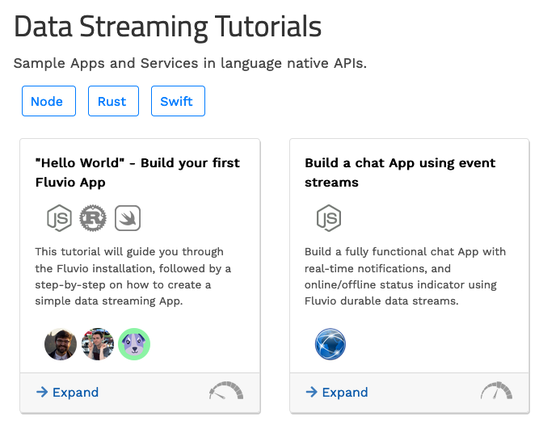

# Documentation for Writers

Fluvio Website was written in Hugo. Checkout [Hugo Documentation](https://gohugo.io/documentation/) for the directory layout and other introductory information. This document describes the formatting and the customizations created for Fluvio website.

## Formatting and Short Codes

The following document has a list of formatting and short code samples: 

* [https://fluvio.io/docs/samples](https://fluvio.io/docs/samples)

The content for the page is generated from the following markdown: 

* [https://github.com/infinyon/fluvio-website/blob/stable/content/docs/samples.md](https://github.com/infinyon/fluvio-website/blob/stable/content/docs/samples.md)


## Tutorial Section

The Tutorials page displays a variety of guides that are used to teach users about Fluvio.
Each guide has language-specific adaptations for each programming language.
Each tile on the page represents a specific guide, and the icons on the tile represent
the language adaptations that are available for that particular guide.



Each guide has a root file that describes the language-specific tutorials available. For
example, we have a "Hello world" guide described by the [`/tutorial/hello-world.md`] file.
This root file just contains information describing all of the tutorials for this guide.
This is used to tell Hugo how to render the tiles and icons on the tutorials main page.

The most imporatnt ield is`tags`. The tags field is used to indicate
which language adaptations are available and which icons to show on the tile.

For example, [`hello-world.md`] has 3 tags:

[`hello-world.md`]: ./content/tutorials/hello-world.md

```
---
title: '"Hello World" ...'
desc: ...
tags:
  - node
  - rust
  - swift
githubAuthors:
  - ...
difficulty: low
weight: 10
```

The `front matter` parameters for the **root** file are defined as follows:

* **title**: header of the tile
* **desc**: description of the tile
* **tags**: programming language supported by this tile - each programming language must have a separate file with the same name in the "/<tag>" directory.
* **githubAuthors**: github usernames of the authors this tile displayed as github avatars
* **difficulty**: [low, medium, high] controls the difficulty icon of the tile
* **weight**: controls the tile position in the list

Each tile must have at least two files with the same name:

* **root file**: a file with no content such as `/tutorial/hello-world.md` that controls the tile content and the tags.
* **programming language files**: one or more files such as `/node/hello-world.md`, `/rust/hello-world.md`, etc. - one file per tag. All files must have hte same name.

Each `programming language file` is managed through the `front matter` and the optional `short code` defined below. 

For example, [`hello-world-node.md`] has the following `front matter`:

[`hello-world-node.md`]: ./content/tutorials/hello-world-node.md

```
---
title: '"Hello World" ...'
toc: true
---
```

The `front matter` parameters for the **programming language** file are defined as follows:

* **title**: header of the file
* **toc**: if true, the TOC is automatically computed and displayed

The `short code` is a script that generates the language selection buttons. In general the language selector short code should be placed right below the front matter:

```

```

If there is only one programming language, the short code may be omitted.

**NOTE**: Each programming language has a corresponding icon that must be added to the following directory:

```
./static/img/tiles/
```

and mapped in the following `partial`:

```
./layouts/partials/tutorial/print-languages.html
```
