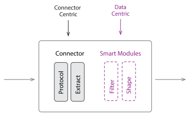

Fluvio's Connectors are components that may be deployed to import or export streaming data
from or to a third-party data platform. Connectors are packaged and distributed as Docker images,
allowing for portability and consistency from a deployment perspective, and simplicity and
flexibility from a development perspective. Fluvio also provides a uniform mechanism for
configuring instances of connectors via `yaml` config files.

Each connector is either a `source`, which imports data, or a `sink`, which exports data.
Connectors may be deployed in one of two ways: as a Managed Connector,
in which the Fluvio cluster provisions and manages the connector; or as a Local Connector,
in which you manually launch the connector as a docker container where you want it.
Additionally, connectors conceptually have four stages, where each stage has distinct responsibilities.
These stages are the same for sources and sinks, but in reverse order. For a source connector,
the stages are as follows:



- **Protocol**: Parses input data according to the wire format of the connected data platform.
- **Extract**: Extracts raw data from the protocol format and packages it neatly into data structures
  that may be used by subsequent stages or be produced directly to a topic.
- **Filter** (optional): A user-provided SmartModule that may determine whether a given record
  should be discarded before sending it over the network to Fluvio, saving bandwidth.
- **Shape** (optional): A user-provided SmartModule that may take the extracted data structures and
  transform them in to an application-specific format.

The **Protocol** and **Extract** stages are built directly into the implementation of each
connector, and have domain-specific logic according to the data platform the connector is
integrating with. The data format output by the **Extract** stage is therefore "opinionated"
with respect to the particular data platform being connected to. However, for some applications,
it is useful to be able to perform some custom pre-processing on the data, before it even
arrives to your Fluvio topic. The **Filter** and **Shape** stages are present so that you
can provide your own SmartModules with custom code to manipulate data before it's sent to
Fluvio from the connector.

In this overview, we'll cover the two deployment styles for connectors, how to apply
configurations for connectors, and how to use SmartModule capabilities for custom processing
in Smart Connectors.

## Managed Connectors

Managed Connectors are deployed within the Fluvio cluster, and are available when
using Fluvio via [InfinyOn Cloud] or when running in Kubernetes (e.g. via `fluvio cluster start`).
When using InfinyOn Cloud, Managed Connectors are recommended over Local Connectors.

When we launch a Managed Connector, we must define a configuration file (usually called
`connect.yml`), which gives all the required options for the connector instance.
Here's a sample `connect.yml` that will launch an HTTP connector that fetches cat facts
from a JSON API.

%copy%
```yaml
# connect.yml
version: v1
name: cat-facts
type: http
topic: cat-facts
create_topic: true
direction: source
parameters:
  endpoint: https://catfact.ninja/fact
  interval: 10
```

We can run this Managed Connector with the following command:

%copy first-line%
```bash
$ fluvio connector create --config=./connect.yml
```

Once the connector is created, we should be able to check that it exists using
the `list` command.

%copy first-line%
```bash
$ fluvio connector list
 NAME       STATUS
 cat-facts  Running
```

Now that our connector us up, we can check on the traffic coming into our topic!
Use the `fluvio consume` command to look at the `cat-facts` topic:

%copy first-line%
```bash
$ fluvio consume cat-facts -B
{"fact":"A cat almost never meows at another cat, mostly just humans. Cats typically will spit, purr, and hiss at other cats.","length":116}
{"fact":"In one stride, a cheetah can cover 23 to 26 feet (7 to 8 meters).","length":65}
{"fact":"Phoenician cargo ships are thought to have brought the first domesticated cats to Europe in about 900 BC.","length":105}
```

To stop a connector, we can use `fluvio connector delete` and give it the name
of the connector we created, which in this case was "cat-facts".

%copy first-line%
```bash
$ fluvio connector delete cat-facts
```

## Local Connectors

Local Connectors are deployed using Docker. Each connector is packaged into
a container, allowing for easy and portable execution. When running a local connector, configurations
are passed to it using command-line arguments, given at the end of the `docker run` command.

One of the primary ways Local connectors are different from Managed connectors is that
we have to manually set up our Fluvio profile for Local connectors. Fluvio profiles live
in the `~/.fluvio/config` file, and each profile describes how to connect to a specific
Fluvio cluster. Therefore, in order to use a Local connector, we need to give it access to
our `~/.fluvio/config` file.

Let's go ahead and check out what this looks like. First, create a topic for our connector
to pump data into.

%copy first-line%
```bash
$ fluvio topic create cat-facts
```

Now, let's try running the `http` connector in a docker container using the following command:

%copy%
```bash
docker run -d --name="my-http" \
    -v"$HOME/.fluvio/config:/home/fluvio/.fluvio/config" \
    -t infinyon/fluvio-connect-http:latest \
    -- \
    --endpoint="https://catfact.ninja/fact" \
    --fluvio-topic="cat-facts" \
    --interval=10
```

What we're doing here is setting up the HTTP connector to fetch a new cat fact every 10
seconds and produce it to our Fluvio topic `cat-facts`. Here are some important points to
understand about this command:

- `-v"$HOME/.fluvio/config:/home/fluvio/.fluvio/config"`
  - This part of the command is what shares our `~/.fluvio/config` file with the connector
    so that it has access to our Fluvio profiles. The connector will connect using the "active"
    profile in the config, which you can view using `fluvio profile`
- `-t infinyon/fluvio-connect-http:latest`
  - Specifies which docker image should be used to launch this connector. Since we're using
    the HTTP connector, we give it the full name of the container on Docker Hub.
- The rest of the arguments are specific to the HTTP connector, and you can read more about
  them on [the HTTP connector docs page][1].

You should be able to see the cat facts start rolling in, we can check this
by opening a consumer in another terminal window.

```bash
$ fluvio consume cat-facts -B
{"fact":"A cat almost never meows at another cat, mostly just humans. Cats typically will spit, purr, and hiss at other cats.","length":116}
{"fact":"In one stride, a cheetah can cover 23 to 26 feet (7 to 8 meters).","length":65}
{"fact":"Phoenician cargo ships are thought to have brought the first domesticated cats to Europe in about 900 BC.","length":105}
```

If we want to view the logs of our local connector to ensure it's running properly, we can
use the `docker logs` command, like so:

%copy first-line%
```bash
$ docker logs -f my-http
```

And finally, when we're done with our connector, we can stop it from running using `docker kill`:

%copy first-line%
```bash
$ docker kill my-http; docker rm my-http
```

### About Switching Profiles

When you launch a Local connector, it will use the active profile at the time of startup
in order to determine which Fluvio cluster to connect to. If you switch active profiles,
running connectors will remain connected to the same cluster, they will not automatically
switch over. This is a good thing, because it prevents you from accidentally mixing up your
data sources and destinations by just changing profiles.

However, if you _do_ want to change the Fluvio cluster that a Local connector is using,
you'll need to stop the connector, switch profiles, then re-start the connector:

```bash
$ docker kill my-http
$ fluvio profile switch other-profile
$ docker run -d --name="my-http" \
    -v"$HOME/.fluvio/config:/home/fluvio/.fluvio/config" \
    -t infinyon/fluvio-connect-http:latest \
    -- \
    --endpoint="https://catfact.ninja/fact" \
    --fluvio-topic="cat-facts" \
    --interval=10
```

## SmartModules

Fluvio's official connectors have support for applying SmartModules to perform inline
compute on the data passing through - when used together this way, we call them
"Smart Connectors". One of the reasons Smart Connectors are so beneficial is because
they can help save streaming costs. For example, when using a Source connector to
stream data from a third-party data platform, you may only be interested in receiving
a subset of the available data. With Smart Connectors, you can write custom logic to
filter out irrelevant data _before_ it gets sent over the network and persisted in
your topic, saving on bandwidth and storage.

### Create a SmartModule

Let's create a new SmartModule that we can use with the Http Connector to pre-process
our Cat Facts. From the examples above, we know our raw input records from the API look
like this:

```json
{"length":116,"fact":"A cat almost never meows at another cat, mostly just humans. Cats typically will spit, purr, and hiss at other cats."}
```

It would be nice to remove the `length` field since it is redundant, and make our fact
a top-level string, like this:

```json
"A cat almost never meows at another cat, mostly just humans. Cats typically will spit, purr, and hiss at other cats."
```

To create this SmartModule, we can use `cargo-generate` to start a project with a template
to help us get started. You can install `cargo-generate` with the following command:

%copy first-line%
```bash
$ cargo install cargo-generate
```

Once we have it, we can use it as follows to create our SmartModule:

%copy first-line%
```bash
$ cargo generate --git="https://github.com/infinyon/fluvio-smartmodule-template"
⚠️   Unable to load config file: ~/.cargo/cargo-generate.toml
🤷   Project Name : catfact-map
🔧   Generating template ...
✔ 🤷   Which type of SmartModule would you like? · map
[1/7]   Done: .cargo/config.toml
[2/7]   Done: .cargo
[3/7]   Done: .gitignore
[4/7]   Done: Cargo.toml
[5/7]   Done: README.md
[6/7]   Done: src/lib.rs
[7/7]   Done: src
🔧   Moving generated files into: `catfact-map`...
✨   Done! New project created catfact-map
```

Make sure to navigate into the project directory:

%copy first-line%
```bash
$ cd catfact-map
```

Next, we'll want to add `serde_json` to our dependencies, so we can manipulate the
JSON objects that our connector fetches for us. Add the following line to the
`Cargo.toml` file:


[dependencies]
fluvio-smartstream = { version = "0.3" }
serde_json = "1"


Now, let's write the actual body of the SmartModule. Edit your `src/lib.rs` file
to have the following contents:

%copy%
```rust
use fluvio_smartmodule::{smartmodule, Result, Record, RecordData};
use serde_json::Value;

#[smartmodule(map)]
pub fn map(record: &Record) -> Result<(Option<RecordData>, RecordData)> {
    let input: Value = serde_json::from_slice(record.value.as_ref())?;
    let fact = &input["fact"];
    let output = serde_json::to_string(fact)?;

    Ok((record.key.clone(), output.into()))
}
```

Here, we're simply parsing the input as JSON and extracting the `fact` field from
the object.

Next, we need to build the SmartModule and register it with Fluvio so that our
connector will be able to find it. To build it, use the following command:

%copy first-line%
```bash
$ cargo build --release
```

Then to register the SmartModule with Fluvio, use this command:

%copy first-line%
```bash
$ fluvio smartmodule create catfact-map --wasm-file=target/wasm32-unknown-unknown/release/catfact_map.wasm
```

The last step is to launch our connector using the SmartModule we just built.
This step is different for Local Connectors and Managed Connectors, so check out
the relevant section for you below.

### Apply to Local Connectors

Launching a Smart Connector locally is as easy as adding one additional argument to the docker command.
Depending on which SmartModule type you're using, you'll choose one of the following arguments:

- `--filter`
- `--map`
- `--arraymap`

For this example, we'll be using `--map`, and providing the name of the
SmartModule we just created, like so:

%copy%
```bash
docker run -d --name="my-http" \
    -v"$HOME/.fluvio/config:/home/fluvio/.fluvio/config" \
    -t infinyon/fluvio-connect-http \
    -- \
    --endpoint="https://catfact.ninja/fact" \
    --fluvio-topic="cat-facts" \
    --interval=10 \
    --map="catfact-map"
```

### Apply to Managed Connectors

Launching a Smart Managed Connector is as simple as updating the `connect.yml` configuration.
For this example, we would add `map` to the `parameters` section, like so:

%copy%
```yaml
# connect.yml
version: v1
name: cat-facts
type: http
topic: cat-facts
create_topic: true
direction: source
parameters:
  endpoint: https://catfact.ninja/fact
  interval: 10
  map: "catfact-map"
```

Followed by launching it with `fluvio connector`:

%copy first-line%
```bash
$ fluvio connector create --config=./connect.yml
```

[1]: sources/http
[InfinyOn Cloud]: https://infinyon.cloud/signup
