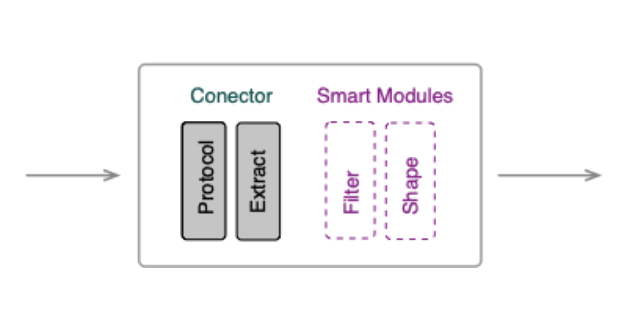

Fluvio's Connectors are components that may be deployed to import or export streaming data
from or to a third-party data platform. Connectors are packaged and distributed as Docker images,
allowing for portability and consistency from a deployment perspective, and simplicity and
flexibility from a development perspective. Fluvio also provides a uniform mechanism for
configuring instances of connectors via `yaml` config files.

Each connector is either a `source`, which imports data, or a `sink`, which exports data.
Connectors may be deployed in one of two ways: as a Managed Connector,
in which the Fluvio cluster provisions and manages the connector; or as a Local Connector,
in which you manually launch the connector as a docker container where you want it.
Additionally, connectors conceptually have four stages, where each stage has distinct responsibilities.
These stages are the same for sources and sinks, but in reverse order. For a source connector,
the stages are as follows:



- **Protocol**: Parses input data according to the wire format of the connected data platform.
- **Extract**: Extracts raw data from the protocol format and packages it neatly into data structures
  that may be used by subsequent stages or be produced directly to a topic.
- **Filter** (optional): A user-provided SmartModule that may determine whether a given record
  should be discarded before sending it over the network to Fluvio, saving bandwidth.
- **Shape** (optional): A user-provided SmartModule that may take the extracted data structures and
  transform them in to an application-specific format.

The **Protocol** and **Extract** stages are built directly into the implementation of each
connector, and have domain-specific logic according to the data platform the connector is
integrating with. The data format output by the **Extract** stage is therefore "opinionated"
with respect to the particular data platform being connected to. However, for some applications,
it is useful to be able to perform some custom pre-processing on the data, before it even
arrives to your Fluvio topic. The **Filter** and **Shape** stages are present so that you
can provide your own SmartModules with custom code to manipulate data before it's sent to
Fluvio from the connector.

In this overview, we'll cover the two deployment styles for connectors, how to apply
configurations for connectors, and how to use SmartModule capabilities for custom processing
in Smart Connectors.

## Deploying Local Connectors

Local Connectors are deployed using Docker running locally. Each connector is packaged into
a container, allowing for easy and portable execution. When running a local connector, configurations
are passed to it using command-line arguments, given at the end of the `docker run` command.

If you have a Fluvio cluster running, we can test this out using the `http` connector in
a local deployment. Let's create a new topic for our connector to feed with data:

%copy first-line%
```bash
$ fluvio topic create cat-facts
```

A good way to get started with a new connector is to check out its help menu, so we can see
the arguments that are available and/or required.

%copy%
```bash
docker run \
    -v"$HOME/.fluvio/config:/home/fluvio/.fluvio/config" \
    -t infinyon/fluvio-connect-http \
    -- \
    --help
```

```bash
http 0.1.0

USAGE:
    http [OPTIONS] --endpoint <endpoint> --fluvio-topic <fluvio-topic>

FLAGS:
    -h, --help       Prints help information
    -V, --version    Prints version information

OPTIONS:
        --body <body>                                    HTTP body for the request
        --endpoint <endpoint>                            Endpoint for the http connector
        --fluvio-topic <fluvio-topic>                    The topic where all things should go
        --interval <interval>                            Interval between each request [default: 300]
        --method <method>
            HTTP method used in the request. Eg. GET, POST, PUT... [default: GET]

        --rust-log <rust-log>                            The rust log level
        --smartstream-arraymap <smartstream-arraymap>
            Path of arraymap smartstream used as a pre-produce step If not found file in that path, it will be fetch the
            smartmodule with that name if present
        --smartstream-filter <smartstream-filter>
            Path of filter smartstream used as a pre-produce step If not found file in that path, it will be fetch the
            smartmodule with that name if present
        --smartstream-map <smartstream-map>
            Path of map smartstream used as a pre-produce step If not found file in that path, it will be fetch the
            smartmodule with that name if present
```

We can see here that we need to include at least `--endpoint` and `--fluvio-topic`, and that
the other arguments are optional. Let's try out the connector with the following command:

%copy%
```bash
docker run \
    -v"$HOME/.fluvio/config:/home/fluvio/.fluvio/config" \
    -t infinyon/fluvio-connect-http \
    -- \
    --endpoint="https://catfact.ninja/fact" \
    --fluvio-topic="cat-facts" \
    --interval=10
```

Here, we're doing a bit of setup for the container, then passing arguments to the connector
itself. Here's what the arguments are doing:

- `-v"$HOME/.fluvio/config:/home/fluvio/.fluvio/config"`:
  - Mounts your `~/.fluvio/config` into the container so the connector can use it to connect to your Fluvio cluster
- `-t infinyon/fluvio-connect-http`:
  - Specifies which docker image should be used to launch this connector
- `--`: Denotes the end of docker arguments and the beginning of the connector's arguments

You should be able to see the cat facts start rolling in, we can check this
by opening a consumer in another terminal window.

```bash
$ fluvio consume cat-facts -B
{"fact":"A cat almost never meows at another cat, mostly just humans. Cats typically will spit, purr, and hiss at other cats.","length":116}
{"fact":"In one stride, a cheetah can cover 23 to 26 feet (7 to 8 meters).","length":65}
{"fact":"Phoenician cargo ships are thought to have brought the first domesticated cats to Europe in about 900 BC.","length":105}
```

## Deploying Managed Connectors

Managed Connectors are deployed within the Fluvio cluster itself, and therefore are not
available when using a local cluster (i.e. when using `fluvio cluster start --local`).
They _are_ available when using Fluvio via [InfinyOn Cloud] or when running in Kubernetes
(e.g. via `fluvio cluster start`).

When we launch a Managed Connector, we must define a configuration file (usually called
`connect.yml`), which gives all the required options for the connector instance.
A sample `connect.yml` that behaves equivalently to the connector shown in the Local Connectors
section would look like this:

```yaml
# connect.yml
version: v1
name: cat-facts
type: http
topic: cat-facts
create_topic: true
direction: source
parameters:
  endpoint: https://catfact.ninja/fact
  interval: 10
```

We can launch this Managed Connector with the following command:

%copy first-line%
```bash
$ fluvio connector create --config=./connect.yml
```

Once the connector is created, we should be able to check that it exists using
the `list` command.

%copy first-line%
```bash
$ fluvio connector list
 NAME       STATUS
 cat-facts  Running
```


---
---
---
---
---
---
---

Fluvio stores the source code for its connectors in the [fluvio-connectors
repository].  When a new connector is released, it is packaged in a Docker container and published on Dockerhub. In addition, the connector catalog list all available source or sink connectors. 

At the moment, Fluvio has two official connectors:
* [test-connector (source)]
* [mqtt-connector (source)]

[Test source connector] produces a new record every 1000ms to the topic of your choice. Use this connector to test the infrastructure and create your custom connectors.

[MQTT source connector] is a client implementation of an MQTT protocol, and it reads messages from an MQTT server and produces them to a fluvio topic.

Fluvio cluster offers a connector command-line interface (CLI) to start, stop and get the status of a container. A cluster may run many instances of the same or different connectors simultaneously.  Fluvio manages the connector infrastructure through Kubernetes. If you run a local installation of Fluvio, make sure it runs `minikube` or `k3d`.

-> Fluvio **local clusters** installed outside of Kubernetes are not supported at this time.

[fluvio-connectors repository]: https://github.com/infinyon/fluvio-connectors
[test-connector (source)]: https://github.com/infinyon/fluvio-connectors/tree/main/test-connector
[mqtt-connector (source)]: https://github.com/infinyon/fluvio-connectors/tree/main/mqtt
[Test source connector]:  https://github.com/infinyon/fluvio-connectors/tree/main/test-connector
[MQTT source connector]: https://github.com/infinyon/fluvio-connectors/tree/main/mqtt


## Connector Configuration

Fluvio uses configuration files to instantiate connectors. The configuration file has two sections:

* connector definition
* connector properties

The `connector definition` section has the following parameters:

```yaml
version: v1                     
name: unique_identifying_name
type: official_connector_type   # pick from connector catalog
direction: source_or_sink
topic: my_fluvio_topic
create_topic: true              # optional
```

The `connector properties` are fields required by the external service.

```yaml
parameters:
  connector_arg_key1: connector_arg_val1
  connector_arg_key2: connector_arg_val2
```

For a list of parameters, check connector properties in the connector catalog.


## Define a Connector

Starting a connector is a two-step process: create the `configuration file`, run the `create connector` command.


### Mqtt Example

An sample `configuration file` for an mqtt connector:

%copy%

```yaml
version: latest
name: my-test-mqtt
type: mqtt
direction: source
topic: my-mqtt
create_topic: true
parameters:
  mqtt-url: "mqtt.hsl.fi"
  mqtt-topic: "/hfp/v2/journey/#"
  fluvio-topic: my-mqtt
```

In the future, Fluvio connector catalog will describe and verify the arguments
before connector creation. For now you must ensure the configuration parameters are accurate:

* `version` is the version of the connector from connector catalog.
* `name` is the connector name as defined in the connector catalog.
* `type` is the unique identifier of the connector.
* `direction` defines if the connector is sink or source.
* `topic` is the fluvio topic the connetor will publish to.
* `parameters` is the list of parameters as defined by the connector.
  * `mqtt-url` defines the mqtt server url.
  * `mqtt-topic` defines the mqtt topic.
  * `timeout` controls reconnection logic (optional).
  * `qos` manages quality of service (optional).

For additional information, checkout mqtt connector in [github](https://github.com/infinyon/fluvio-connectors/blob/main/mqtt/src/main.rs).


### Test-connector Example

An sample `configuration file` for a test connector:

%copy%

```yaml
version: latest
name: my-test-connector
type: test-connector
topic: my-test-connector
create_topic: true
direction: source
parameters:
  topic: my-test-connector
```

The `connector definition` section is defined above and not repeated here. The test connector specific parameters are:
* `timeout` interval for sending records in miliseconds (default: 1000 miliseconds).
* `count` the number of records to produce (defaults to i64 max).

For additional information, checkout test connector in [github](https://github.com/infinyon/fluvio-connectors/blob/main/test-connector/src/main.rs).

## Connector Commands

To show a list of available connector commands, run the following CLI:

%copy first-line%
```bash
$ fluvio cluster connector -h
```

### Create a Connector

Use the following cli command to create a connector:

%copy first-line%
```bash
$ fluvio cluster connector create --config my-connector-config.yaml
```

If the `create_topic` is configured, a topic is created. If the topic already exists, the command is ignored. If `create_topic` is not configured, and the topic does not exist, the connector returns an error.


### List all Connectors

Use the following cli command to retrieve the status of the connectors:

%copy first-line%
```bash
$ fluvio cluster connector list
-------------
 NAME               STATUS
 my-test-connector  Running
      my-test-mqtt  Running
```

### Delete a Connector

Use the following cli command to delete a connector:

%copy first-line%
```bash
$ fluvio cluster connector delete my-test-connector
```

Deleting a connector does not impact the topic. Hence, the records are available for reading after the connector is deleted. Recreating the same connector will resume publishing to the same topic.

[InfinyOn Cloud]: https://infinyon.cloud/signup
