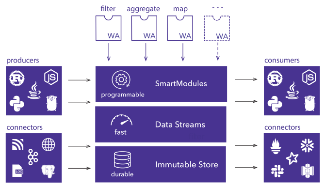

Fluvio is an open source streaming platform that aggregates, correlates,
and applies programmable intelligence to data in motion.

At the base level, Fluvio has a distributed, immutable, persistent log store
written from the ground up in Rust. At the next level up is an asynchronous
and horizontally scalable data streaming layer for low-latency delivery of
stream events. Built on this streaming layer is Fluvio's programmable
SmartStreams, which allow users to perform inline computations on streaming
data without leaving the cluster. SmartStreams are powered by WebAssembly
modules containing custom user-written code, which are granted access to
filter, transform, and otherwise modify the data flowing from the stream.
Fluvio provides client libraries for several popular programming languages
as a means to easily integrate these real-time streaming capabilities into
third-party applications.

Let's dive in and take a look at each of Fluvio's layers more closely.

## Immutable Log Store

Fluvio's storage layer is an immutable log store. As records are
streamed to Fluvio, they get written to disk and have a unique log offset. New
logs begin at offset 0, and each new record is assigned offsets in increasing
order. Once a record is written and given an offset, that record's contents and
offset will never change (the record is immutable).

### Durability through Replication

As a distributed system, Fluvio runs on many machines at once - called a "cluster".
Fluvio leverages this in order to keep multiple copies of streaming data available
at all times, so if one of the machines in the cluster fails, data is not lost.
A configurable "replication factor" describes how many copies must be maintained
at all times - if any replica goes down, a new one is created to replace it.

### Zero copy

Fluvio's streaming protocol uses the same format over-the-wire and on disk,
allowing it to use zero-copy and write data directly from the network adapter to
storage, giving the fastest possible throughput.

## Data Streams

Fluvio's primary goal is to stream data to and from client programs, known as
Producers and Consumers. Fluvio's Streaming Processing Units (SPUs) are built to 
deliver data at massive scale and low latency. SPUs are designed to scale
horizontally and use asynchronous programming patterns to handle concurrent
client connections with ease.

### Scaling at Low Latency with Asynchronous Rust

Fluvio's SPUs are written using Asynchronous Rust in order to handle many concurrent
streaming requests from clients without blocking threads. This allows SPUs to
continue operating at maximum efficiency even with high traffic demands, utilising
the full capabilities of the hardware available.

### Scaling at High Volume with Partitioned streaming

Fluvio's data streams support partitioning, allowing the data in a stream to be
divided into many smaller, independent streams. Records are distributed among partitions
based on keys that may be associated with the record's data, and all records with the
same key are always delivered to the same partition. Dividing a stream into partitions
like this allows for each partition to potentially be processed by an entirely different
SPU, providing a natural mechanism for horizontal scaling.

## Programmable SmartStreams

