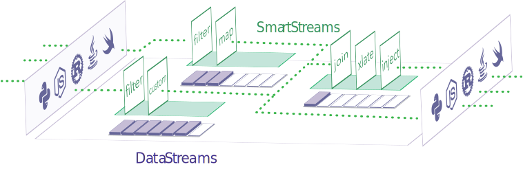

Fluvio is a high-performance data streaming platform for collaborative apps. Whether you are looking to enhance your app with a custom chat channel, receive real-time events from your legacy database, communicate with other services in real-time, or stitch together a log aggregator for your mobile or IOT devices, Fluvio is the data streaming platform for you. Our focus on speed, scale, multi-platform support, native language APIs, and ease of use removes many barriers to adoption.

}}

Fluvio can be installed on your personal computer, in a private data center, or on a public cloud. Virtually anywhere <a href="https://kubernetes.io/" target="_blank">Kubernetes</a> is available.

## Core Capabilities

The key tenets of this architecture are as follows

* [data streaming](#data-streaming)
* [language native APIs](#language-native-apis)
* [ease of use](#ease-of-use)

### Data Streaming

Data streaming is data that is **generated continuously** by any number of sources in many different formats. Your data might be:

* logs or traces generated by mobile or web applications
* sensors from industrial robots, drones, or farm equipment
* financial stock tickers
* online purchases
* in-game player activity
* telemetry from connected devices
* database events

and more.

Fluvio data streaming is designed for **horizontal scale**. Multiple data streams can concurrently ingest and replicate data for resiliency. Data is processed sequentially on a record-by-record basis in the order it was received, and it is stored in immutable streams. A user-configurable retention period controls the length of time the data is retained. The **retention period** can be anywhere from hours to years.

Fluvio producers can write to one or more data streams and consumers can read from any number of streams.

Fluvio data streaming is designed for _speed_, _scale_, _security_ and _resiliency_.

#### Speed

Fluvio is written in **Rust**, a programming language designed for _code safety_ and _performance_.  For instance, a <a href="https://medium.com/@dexterdarwich/comparison-between-java-go-and-rust-fdb21bd5fb7c" target="_blank">benchmark</a> comparison between Rust and Java on a simple web server implementation revealed that Rust outperforms Java in many areas:

| Performance Test        |   Java   |   Rust   | Improvement |
| ----------------------- | :------: | :------: | :---------: |
| **Latency** (Fibonacci) | 1,900 ms | 57.71 ms |  **~30x**   |
| **Memory**              | 1,498 ms | 16.94 ms |  **~25x**   |
| **Idle Memory**         |  162 Mb  | 0.36 Mb  |  **~450x**  |
| **CPU Utilization**     |   73%    |   24%    |   **~3x**   |
| **Program Size**        |  27 Mb   |  3.7 Mb  |   **~8x**   |

These values are derived from a simple web server implementation and can be significantly higher in large programs with many libraries and dependencies.

Fluvio also takes advantage of other Rust capabilities, such as: 

* <a href="https://rust-lang.github.io/async-book/01_getting_started/02_why_async.html" target="_blank">Asynchronous Code</a> to scale out workloads effortlessly
* <a href="https://blog.rust-lang.org/2015/04/10/Fearless-Concurrency.html" target="_blank">Fearless Concurrency</a> to leverage the CPU's full power
* <a href="https://en.wikipedia.org/wiki/Zero-copy" target="_blank">Zero-copy</a> for fast I/O wherever possible

While other data streaming platforms use polling to consume messages, Fluvio uses *async processing* for significantly lower latency.

#### Scale

Fluvio is designed for **horizontal scale**, with multiple Streaming Processing Units being gradually dispatched to handle an increasing number of concurrent data streams.

Fluvio uses **partitioning** to divide data into smaller sub-streams for availability, fault tolerance and manageability. Each partition is an independent data streaming unit that can scale independently. Partitions are distributed evenly across Streaming Processing Units (SPUs) to ensure a balanced system. This architecture choice enables Fluvio clients to write-to or read-from multiple partitions simultaneously.

For additional information, check out the [Topic/Partition](/docs/architecture/topics-partitions/) section in the [Architecture](/docs/architecture) document.

#### Security

Fluvio is designed with **security** and **privacy** in mind. Fluvio producers, consumers, and other clients must authenticate with a target Cloud cluster and download security certificates before they are authorized access. The platform uses the certificates with TLS to encrypt all communication between the clients and the cluster.

#### Resiliency

Fluvio is designed for **fault tolerance** and **high availability**. Data streams are replicated and can survive multiple points of failure. Failures may range from crash of a host machine to network outages, and more. Fluvio ensures that data streams remain available with minimal interruption for subsequent processing.

All system components have self-healing recovery mechanisms and automatic failover to increase resiliency and simplify usability. Fluvio has built-in eventual consistency to allow recovering SPUs to update their internal state and rejoin the cluster as fully functional units.

For additional information, check out the [Replica Election](/docs/architecture/replica-election/) section in the [Architecture](/docs/architecture) document.

### Language Native APIs

Fluvio is designed to integrate natively with most programming languages.  The following native interfaces are listed in order of priority:

* [Rust] &#10004;
* [Node.js] &#10004;
* [Python] &#10004;
* Java - &#10004;
* Go - *Community Supported*
* Swift - *roadmap*

[Rust]: https://docs.rs/fluvio
[Node.js]: https://infinyon.github.io/fluvio-client-node/
[Python]: https://infinyon.github.io/fluvio-client-python/fluvio.html

The APIs can be used to manage and operate all areas of the systems:

* clusters
* data streams
* consumer
* producers

Fluvio supports polyglot environments where App modules written in different programming languages use native interfaces to access data streams. 

### Ease of Use

Fluvio is designed for **operational efficiency** and **ease of use**.

Built-in cluster management capabilities normalize and simplify all infrastructure operations. The platform can be installed just as easily on a laptop, a data center, or a public cloud. Integrated Kubernetes capabilities make Fluvio easy to install in any modern Enterprise environment.

Fluvio is designed for developers. The built-in installer helps you get up and running quickly. The profile-based configuration allows you to switch between different Fluvio installations with ease. Native language support gives you the flexibility to pick your programming language of choice - where data streaming APIs are managed through native code. Fluvio's developer-first approach eliminates complexity and minimizes the learning curve required to bootstrap and run a data streaming environment.

Fluvio uses declarative configurations instead of imperative commands to manage system resources such as topics and partitions. The declarative configuration approach lets the platform provision resources dynamically as they become available and self-heal from failures. Existing data streaming platforms return errors and leave all remediation tasks to the operator to resolve. When using Fluvio, operators give you the confidence to configure and walk away. You can trust that the platform will recover from errors and operate at optimal performance.

## Key Features

A subset of key features are as follows:

* **Declarative Management**: Fluvio allows operators to declare desired state and the system will do the rest. No resource available, no worries, the objects are shown `in progress` until the resource constraints are resolved.

* **Ultra Low Latency**: Fluvio takes advantage of Rust's async runtime to improve system performance and achieve low latency. It utilizes all available cores and interacts directly with hardware I/O. Unlike other streaming platforms where garbage collection adds unpredictable latency, Fluvio latency is constant and predictable. 

* **Low Memory Footprint**: Fluvio can be deployed in as little as 100Mb of memory. The deployment is highly optimized machine code and it does not require an intermediary virtual machine. Fluvio can be run on devices such as the Raspberry Pi and are suitable for IOT devices running at the edge.

* **Built-in Retention**: Fluvio uses long-lived immutable storage to persist data streams. Each data stream is copied to multiple servers and retained for hours or years. Fluvio clients have built-in failure detection and switch-over mechanisms to minimize downtime. Fluvio's retention mechanism allows clients to come and go without concerns over data loss.

* **Guaranteed Message Ordering**: Fluvio guarantees partition-level message ordering. Messages are stored and forwarded to consumers in the order they are received from the producers. Order guarantee is a critical requirement in many stateful systems.

* **Cloud Native by Design**: CNCF defines “Cloud Native” as an approach that utilizes cloud computing to build and run scalable applications in modern, dynamic environments. Cloud Native products are centered around Kubernetes, often called the “kernel of the cloud”. Fluvio is designed to work natively with Kubernetes. It uses Helm charts for installation, CRDs for provisioning, and Operators to interact with the KV store.

* **Developer Friendly**: Fluvio offers native language bindings in many modern programming languages such as Rust and Node. Future release will gradually introduce additional languages such as Swift/Objective-C, Python, and Go.

* **Powerful CLI**: Fluvio offers a powerful CLI that controls virtually all aspects of the system: installation, provisioning, data streaming, and monitoring. In addition, the CLI can manage any number of installations whether they are on your local system, in your data center, or in the public cloud.